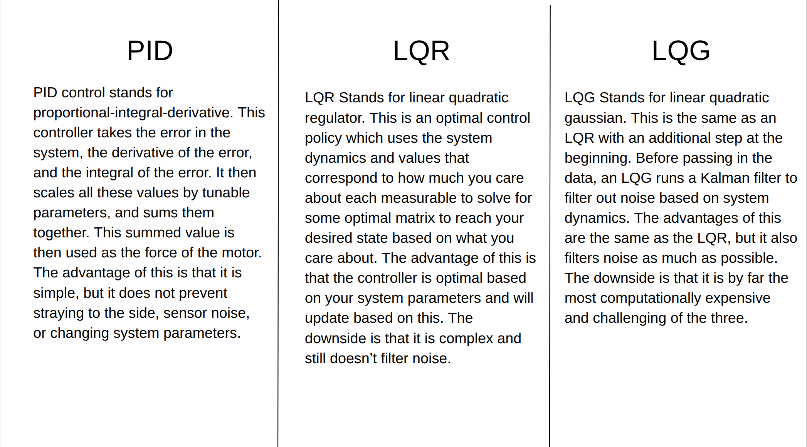

# Cart-Pendulum Simulator

An interactive physics simulation of an inverted pendulum on a cart. The system is numerically integrated using Verlet integration and supports three closed-loop controllers — PID, LQR, and LQG — with live parameter tuning and configurable sensor noise.



## Features

- **Physics simulation** — equations of motion solved via Verlet integration at 60 Hz
- **Swing-up** — energy-based controller that pumps the pendulum up from any position before handing off to the selected controller
- **Three controllers** with tunable gains:
  - **PID** — proportional-integral-derivative control on pendulum angle
  - **LQR** — optimal state feedback via the Algebraic Riccati Equation (solved with a Schur decomposition)
  - **LQG** — LQR with an Extended Kalman Filter (EKF) for state estimation under noise
- **Sensor noise** — adjustable Gaussian noise on all four state measurements (position, velocity, angle, angular velocity)
- **Live tuning** — change controller gains, system parameters, and noise level mid-simulation
- **Force visualization** — arrows showing controller and external forces with a live force/energy readout

## Installation

```bash
pip install cmu-graphics numpy scipy
```

Then run:

```bash
python Cart_Sim.py
```

## Controls

### Setup screens

| Input | Action |
|-------|--------|
| `S` | Start / return to parameter screen |
| `P` | Toggle between system parameters and controller selector |
| Click a circle | Select that parameter |
| `↑` / `↓` | Increment / decrement selected parameter |
| Click a controller panel | Select that controller |
| Click a gain circle | Select that gain for tuning |
| Info icon (top-left) | View controller reference sheet |

### Simulation

| Input | Action |
|-------|--------|
| `S` | Return to setup screen |
| `P` | Toggle selected controller on/off |
| `R` | Recenter cart |
| `←` / `→` (hold) | Apply external force to cart |
| Click PID / LQR / LQG (top-right) | Switch controller |
| Click a gain circle (bottom-right) | Select for live tuning |
| `↑` / `↓` | Tune selected live parameter |
| Click noise circle (top-left) | Select noise level for tuning |

## System Parameters

| Parameter | Default |
|-----------|---------|
| Cart mass | 10 kg |
| Pendulum mass | 1 kg |
| Pendulum length | 0.5 m |
| Gravity | 9.8 m/s² |

## Controller Details

All three controllers share a swing-up phase when the pendulum is outside ±0.65 rad of vertical. The swing-up uses an energy-pumping law that drives the pendulum's mechanical energy toward the upright equilibrium.

**LQR / LQG gains** are defined by cost matrices Q (state penalty) and R (control penalty). The K matrix is recomputed via the Hamiltonian Schur decomposition any time a gain or system parameter changes.

**LQG** adds an EKF on top of LQR. During swing-up and large-angle excursions the EKF is bypassed to avoid filter divergence; it re-engages once the pendulum is near vertical.

## Dependencies

- [cmu-graphics](https://pypi.org/project/cmu-graphics/) — rendering
- [NumPy](https://numpy.org/) — linear algebra
- [SciPy](https://scipy.org/) — Schur decomposition for the Riccati solver
